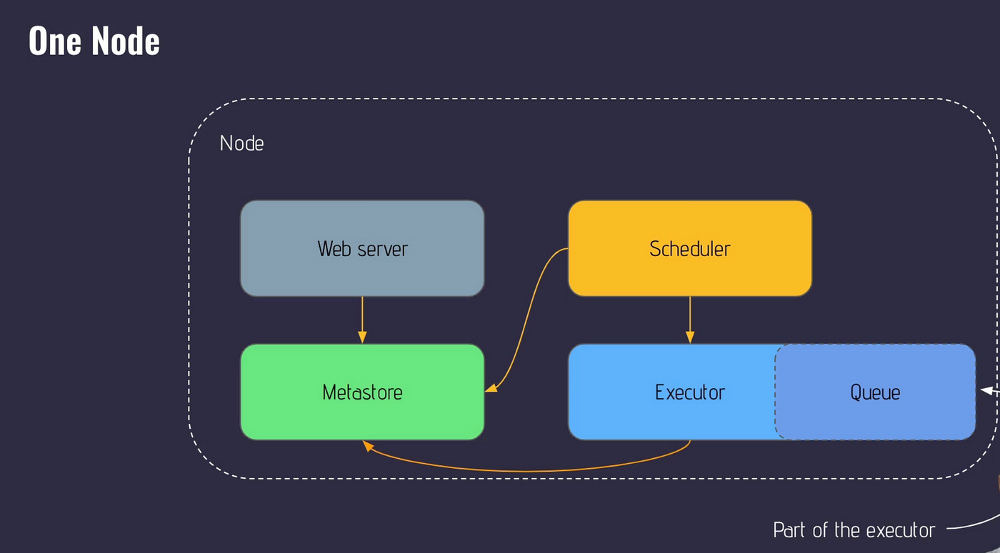
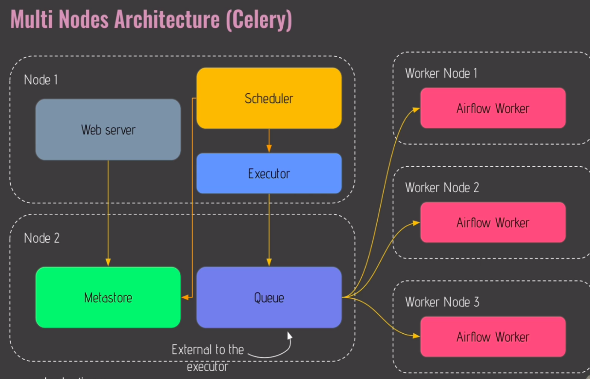

# Airflow Introduction
It is an open source tool to programmatically author, schedule and monitor workflow.

## Components of Airflow
### WebServer
The webserver provides the UI which allows us to view, manage and monitor your workflow.

### Scheduler
Responsible for determining when your task should run.

### Meta Database
Stores the information about the tasks and their status and other important details. For e.g. Which task has run, their results and status

### Triggerer
It is responsible for managing deferrable tasks for examples tasks that waits for external events to trigger the task.

### Executor
It manages the execution of the task deciding whether to run them in sequence of parallel and on which system.

### Queue
List of tasks waiting to be executed.

### Worker
Processes that actually perform the tasks

## Core Concepts in Airflow

### DAG (Directed Acyclic Graph)
It is a collection of all the task you want to run, organized in a way that reflects their dependencies. It helps you defining the structure of your entire workflow, showing which task needs to happen before others.
It has to be Acyclic meaning this graph shouldn't indicate any loop or cyclic dependenices.

### Operator
An operate is a single, ideally impotent task in your DAG. It's like individual step which produces same output for same input everytime. This allows us to break down workflow into discrete, manageable pieces of work.
Airflow has thousands of Operators such as ...
- PythonOperator for Python script or function
- BashOperator for Bash
- SQLExecuteQueryOperator for SQL query
- FileSensor to wait for a file

### Task & Task Instance
A task is a specific instance of an operator. When an Operator is assigned to a DAG it becomes a task. Tasks are the actual unit of work that gets executed when you run the DAG. Any operator working or exectuing a task is a task instance.

### Workflow
A workflow is the entire process defined by your DAG, including all tasks and their dependencies. It represent the entire data pipeline, showing how all the pieces fit together to achieve your goal. Like an entire process of doing something like processing CSV files etc.

## Limitations of Airflow | What Airflow is not ?
- Not a realtime processing solution.
- Not a Data processing framework, It's an orchestrator not a data processing engine.
- Not a Storage System

### Unfit Usecases for Airflow
- High Frequency, sub-minute scheduling, like tasks every few seconds. It is for tasks to exectue that runs on intervals of minutes, hours or days.
- Processing large dataset directly. If you mean to process terrabytes of data, You would use something like Spark. However you can use Airflow to trigger a Spark Job.
- Real time data streaming, Use something like Kafka for that.
- Overkill to use for simple and linear workflows with few dependencies. For such simple tasks running cronjob might be a simpler and better choice.

## Common Architectures in Airflow

### Single Node Architecture
In this architecture all the components of the Airflow are running on the same machine.

### Multi Node Architecture
Airflow runs across multiple nodes or machines and used in production environment.

